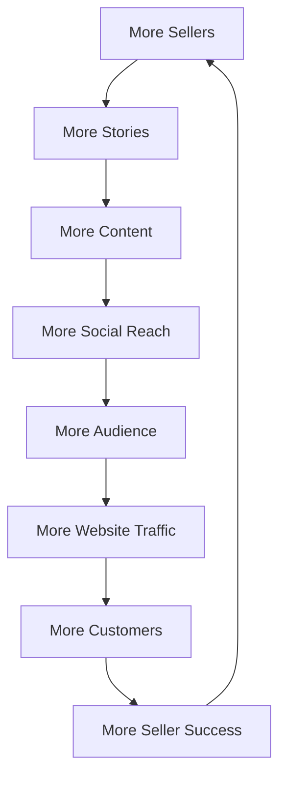
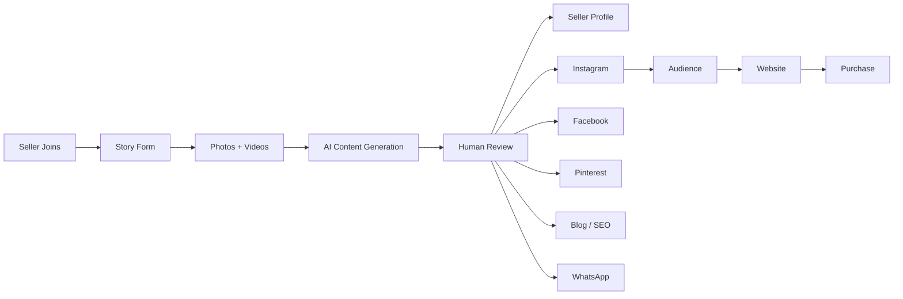
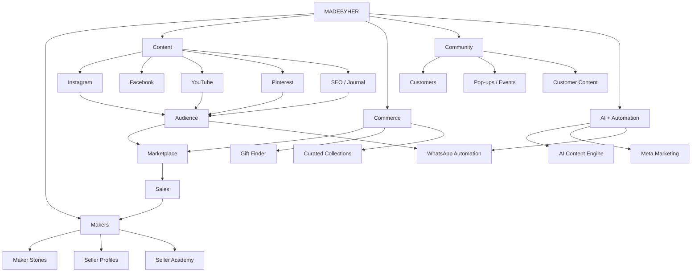

---

title: MadeByHer — Growth & Content Engine  
type: strategy  
brand: MadeByHer  
status: idea  
priority: high  
tags:

- madebyher
    
- strategy
    
- marketing
    
- content
    
- ecommerce
    
- marketplace
    
- growth
    

---

# MadeByHer — Growth & Content Engine

> [!abstract] Core Idea  
> **Don't just sell what women make. Tell people who made it, why they started, how they make it, and what their work means to them.**
> 
> MadeByHer should evolve from a simple marketplace into a **media + community + commerce platform for independent women makers.**

---

# 1. Vision

## The Current Marketplace Model

Traditional marketplace:

```text
Product
   ↓
Price
   ↓
Customer
   ↓
Purchase
```

The customer mainly evaluates:

- Price
    
- Reviews
    
- Photos
    
- Delivery
    
- Features
    

---

## The MadeByHer Model

MadeByHer should introduce a human layer:

```text
Maker
   ↓
Story
   ↓
Craft
   ↓
Product
   ↓
Trust
   ↓
Community
   ↓
Purchase
```

The customer should not only think:

> "I want this product."

They should also think:

> "I know who made this."

---

# 2. The Bigger Positioning

MadeByHer should aim to become:

> **A discovery platform for the women, stories, crafts, food, culture and businesses behind handmade products.**

The marketplace becomes the **commerce layer**.

Social media becomes the **discovery layer**.

Stories become the **human/emotional layer**.

WhatsApp becomes the **conversation layer**.

AI becomes the **scaling layer**.

The website becomes the **commerce + ownership layer**.

---

# 3. The MadeByHer Flywheel



The marketplace itself should continuously generate marketing material.

Every new seller adds:

- A person
    
- A story
    
- A craft
    
- Products
    
- Photos
    
- Videos
    
- Content
    
- Potential customers
    
- A new audience
    
- Cultural knowledge
    

---

# 4. Content Ecosystem

MadeByHer should have multiple content pillars.

## 4.1 Maker Stories

Main recurring series:

### `MADEBYHER STORIES`

Possible tagline:

> **Real women. Real stories. Made by hand.**

Content:

- Meet the Maker
    
- How She Started
    
- Her First Order
    
- Her First Product
    
- Her Workspace
    
- Her Journey
    
- Her Dream
    
- A Day With Her
    
- Why She Makes It
    

---

## 4.2 MadeByHer Culture

Explore the cultural background behind products.

Examples:

- Why Thekua is important during Chhath
    
- Madhubani art
    
- Sujini embroidery
    
- Mithila traditions
    
- Regional foods
    
- Traditional Indian crafts
    
- Festival traditions
    
- Regional clothing
    
- Local ingredients
    

### Objective

Turn:

```text
Product
```

into:

```text
Culture → Story → Maker → Product
```

---

## 4.3 MadeByHer Craft

Show how products are actually made.

Content:

- How it's made
    
- Raw materials
    
- Tools
    
- Making process
    
- Time required
    
- Handmade details
    
- Mistakes
    
- Finishing
    
- Packaging
    

Example:

> "This ₹499 handmade product took 3 hours to make."

---

## 4.4 MadeByHer Finds

Discovery-oriented content.

Examples:

- 5 handmade gifts under ₹500
    
- 10 products you didn't know existed
    
- Handmade gifts for mothers
    
- Handmade wedding gifts
    
- Products made in Bihar
    
- Interesting products from small Indian businesses
    
- 5 unique products from women makers
    

---

## 4.5 MadeByHer Community

Show the ecosystem around the marketplace.

Content:

- Customer unboxings
    
- Customer reviews
    
- Seller milestones
    
- First orders
    
- Seller achievements
    
- Repeat customers
    
- Customer reactions
    
- Community events
    

---

## 4.6 MadeByHer Products

Traditional ecommerce content.

Examples:

- New arrivals
    
- Best sellers
    
- Product demonstrations
    
- Collections
    
- Gift boxes
    
- Seasonal products
    
- Product comparisons
    
- Product details
    

Product content should exist, but should **not completely dominate the social feed.**

---

# 5. The "Meet the Maker" System

Every seller should eventually have a story.

## Standard Reel Structure

### 0–3 sec — Hook

Examples:

> "She started making Thekua from her mother's kitchen."

> "She didn't plan to start a business."

> "This is the woman behind this handmade brand."

> "What started as a hobby became her business."

---

### 3–15 sec — Introduction

Show:

- Seller
    
- Face
    
- Workspace
    
- Products
    

Example:

> "Meet Shrina, founder of Uljhe Dhaage, a handmade crochet business."

---

### 15–30 sec — Beginning

Questions:

- When did you start?
    
- Why?
    
- What inspired you?
    
- What was your first product?
    
- What was your first sale?
    
- Who supported you?
    

---

### 30–45 sec — Craft

Show:

- Hands
    
- Materials
    
- Tools
    
- Making process
    
- Workspace
    
- Product details
    

---

### 45–55 sec — Meaning

Let the seller speak.

Example:

> "For me, this isn't just crochet. It's something I built myself."

Avoid manufacturing emotional stories.

---

### 55–60 sec — CTA

> **Meet more makers on MadeByHer.**

> **Shop her collection →**

---

# 6. One Seller = Multiple Content Pieces

A seller should never be treated as just one Reel.

## Example: Maa Ki Rasoi

### Reel 1

**How Maa Ki Rasoi Started**

### Reel 2

**How Traditional Bihari Thekua Is Made**

### Reel 3

**Meet the Woman Behind Maa Ki Rasoi**

### Reel 4

**Why Thekua Matters During Chhath**

### Reel 5

**How Long Does It Take To Make?**

### Reel 6

**Packing a MadeByHer Order**

### Reel 7

**Her First Order Outside Bihar**

### Reel 8

**Customer Unboxing**

### Reel 9

**A Day in the Kitchen**

### Reel 10

**What She Wants to Build Next**

---

# 7. "First Order" Content

One of the strongest potential story formats.

## Concept

> **"POV: A stranger just bought something you made."**

Sequence:

```text
New order notification
        ↓
Seller sees order
        ↓
Seller reaction
        ↓
Product preparation
        ↓
Packaging
        ↓
Courier pickup
        ↓
Product travelling
        ↓
Customer receives it
```

This turns a normal ecommerce transaction into a story.

---

# 8. Seller Milestones

Celebrate seller progress.

Examples:

- First order
    
- 10th order
    
- 50th order
    
- 100th order
    
- First order outside the state
    
- First repeat customer
    
- First major collection
    
- First exhibition
    
- First collaboration
    

Example:

> **"Today, Shrina shipped her 100th MadeByHer order."**

Only share financial/order information with the seller's permission.

---

# 9. "Where Is She From?"

Create location-based storytelling.

Example:

> **📍 Aurangabad, Bihar**

> Meet the woman behind this handmade brand.

Then:

- Show location
    
- Show maker
    
- Show workspace
    
- Show product
    
- Tell story
    

Eventually create a **MadeByHer Maker Map**.

```text
India
│
├── Bihar
│   ├── Aurangabad
│   ├── Patna
│   ├── Madhubani
│   └── ...
│
├── Rajasthan
├── Punjab
├── Maharashtra
├── West Bengal
└── ...
```

This can become a major discovery feature.

---

# 10. Follow a Maker

Long-term marketplace feature:

> **Follow Maker**

Customers can follow sellers they like.

Then:

> Shrina added 3 new products.

> Maa Ki Rasoi launched a Chhath collection.

> YarnVi Originals released a new crochet collection.

This turns MadeByHer into a **community marketplace** instead of a purely transactional marketplace.

---

# 11. Seller Profiles as Mini Websites

Every seller page should eventually contain:

```text
Maker Profile
│
├── Cover / Hero
├── Maker Story
├── Location
├── Craft
├── Products
├── Making Process
├── Meet the Maker Video
├── Reviews
├── Social Links
└── Follow Maker
```

The customer should feel like they are discovering a small independent brand.

---

# 12. Packaging → Story → Website

Every MadeByHer package can become a bridge between physical and digital.

## Packaging Insert

> **You just bought something handmade.**
> 
> Meet the woman who made it.

Add QR code:

```text
SCAN TO MEET YOUR MAKER
        ↓
madebyher.in/makers/[seller]
```

Seller page contains:

- Story
    
- Reel
    
- Products
    
- Photos
    
- Social links
    

---

# 13. Make Packaging Shareable

Goal:

> **Customer opens package → wants to record it.**

Include:

- Brand card
    
- Maker story
    
- QR code
    
- Beautiful packaging
    
- Social handle
    
- "Tag @MadeByHer"
    
- "Share your unboxing"
    

Then:

```text
Customer
   ↓
Unboxing
   ↓
Instagram
   ↓
MadeByHer reposts
   ↓
More social proof
```

---

# 14. Creator × Maker Collaborations

Don't only pay influencers to advertise products.

Create actual experiences.

## Example

Creator visits a maker.

They:

- Meet her
    
- Learn the craft
    
- Try making the product
    
- Talk about the business
    
- Create content
    
- Shop from her
    

Content:

> **"I spent a day with the woman behind this handmade brand."**

This creates much stronger storytelling than:

> "Use my discount code."

---

# 15. "I Tried Making It"

Potential recurring series.

Examples:

- I tried making Thekua
    
- I tried Madhubani painting
    
- I tried crocheting
    
- I tried making handmade jewellery
    
- I tried making a traditional craft
    

Structure:

```text
Attempt
   ↓
Fail
   ↓
Try again
   ↓
Maker demonstrates
   ↓
Compare
   ↓
Understand the skill
```

The objective is entertainment + education.

---

# 16. "How Long Does It Actually Take?"

Use time-based storytelling.

Example:

```text
Material preparation     20 min
Design                   15 min
Making                  120 min
Finishing                30 min
Packaging                10 min
------------------------------
Total                   195 min
```

Then:

> **This is why handmade isn't mass-produced.**

The objective is to educate customers about handmade value.

---

# 17. "Handmade vs Mass Produced"

This should be educational rather than attacking factories.

Compare:

|Aspect|Handmade|Mass Produced|
|---|---|---|
|Production|Individual maker|Factory|
|Scale|Small|Large|
|Customization|Often higher|Usually standardized|
|Variation|Natural variation|High consistency|
|Production time|Longer|Faster|
|Human involvement|High|Lower per item|

The purpose is to explain **what the customer is paying for**.

---

# 18. Seller Takeovers

Give sellers temporary access to MadeByHer Stories.

Example:

## "A Day With Maa Ki Rasoi"

Morning:

> Good morning from our kitchen.

Afternoon:

> Preparing today's orders.

Evening:

> Packaging.

Night:

> Today's orders are ready.

This creates intimacy and authenticity.

---

# 19. MadeByHer Gift Finder

Build a discovery tool.

### Step 1 — Who?

- Mom
    
- Dad
    
- Sister
    
- Wife
    
- Husband
    
- Friend
    
- Wedding
    
- Corporate
    
- Festival
    

### Step 2 — Budget

- ₹300
    
- ₹500
    
- ₹1,000
    
- ₹2,000
    
- ₹5,000+
    

### Step 3 — Style

- Traditional
    
- Handmade
    
- Food
    
- Fashion
    
- Personalized
    
- Luxury
    
- Home
    

### Output

> **5 handmade gifts selected for you**

This becomes a **commerce + discovery engine**.

---

# 20. Seasonal Collections

Create curated collections.

## Chhath

- Thekua
    
- Traditional food
    
- Gifts
    
- Décor
    

## Diwali

- Handmade gifts
    
- Décor
    
- Candles
    
- Home products
    

## Raksha Bandhan

- Rakhis
    
- Handmade gifts
    
- Personalized products
    

## Mother's Day

- Mother-led businesses
    
- Handmade gifts
    
- "Made by Maa"
    

## Wedding Season

- Wedding gifts
    
- Handmade décor
    
- Personalized products
    

---

# 21. MadeByHer Originals

Eventually curate special products.

Possible collections:

- **MadeByHer Originals**
    
- **Made in Bihar**
    
- **Made by Maa**
    
- **Indian Handmade**
    
- **Festival Collection**
    
- **The Maker's Collection**
    
- **MadeByHer Gift Box**
    

This moves MadeByHer from:

> Marketplace

toward:

> **Curated marketplace + brand**

---

# 22. MadeByHer Journal

Create an editorial section.

## Categories

- Women
    
- Makers
    
- Crafts
    
- Food
    
- Culture
    
- Business
    
- Bihar
    
- India
    
- Gift Guides
    
- Behind the Brand
    

Example articles:

> The Story Behind Traditional Bihari Thekua

> Meet the Woman Behind Maa Ki Rasoi

> How a Hobby Became a Crochet Business

> 10 Handmade Gifts From Indian Women Makers

---

# 23. SEO Engine

Every seller can generate multiple SEO assets.

```text
Seller
   ↓
Story
   ├── Seller Profile
   ├── Blog
   ├── SEO Article
   ├── Product Descriptions
   ├── FAQ
   ├── Instagram Reel
   ├── Pinterest Pin
   ├── Facebook Post
   └── WhatsApp Content
```

One seller interview can become an entire content cluster.

---

# 24. Pinterest Strategy

Pinterest can be used for visual discovery.

Content:

- Handmade gifts
    
- Crochet
    
- Jewellery
    
- Home décor
    
- Wedding gifts
    
- Indian crafts
    
- Food
    
- Festival collections
    

Each Pin should lead back to:

```text
Pinterest
    ↓
MadeByHer
    ↓
Seller / Collection
    ↓
Product
```

---

# 25. YouTube Strategy

Instagram:

> Short discovery

YouTube:

> Deep stories

Website:

> Commerce

WhatsApp:

> Conversation

### Possible YouTube series

**MadeByHer Originals**

5–10 minute documentaries.

Examples:

> From Kitchen to Business — The Story of Maa Ki Rasoi

> The Woman Behind the Crochet Brand

> How Traditional Bihari Food Is Made

---

# 26. Community Events

Long-term:

## MadeByHer Maker Meetups

Bring makers together.

Activities:

- Networking
    
- Workshops
    
- Product demonstrations
    
- Content creation
    
- Photography
    
- Seller education
    

Eventually:

## MadeByHer Pop-Up

Customers meet makers physically.

```text
Maker
  ↓
Product
  ↓
Customer
  ↓
Experience
  ↓
Content
```

The event itself becomes marketing material.

---

# 27. MadeByHer Academy

Help sellers become better businesses.

Topics:

- Product photography
    
- Product pricing
    
- Packaging
    
- Instagram
    
- Reels
    
- Customer service
    
- Product descriptions
    
- Branding
    
- SEO
    
- Shipping
    
- Returns
    
- Business basics
    

This creates:

> **Marketplace + Seller Infrastructure**

rather than just:

> Marketplace.

---

# 28. Seller Acquisition Through Content

Content can also acquire sellers.

Example campaign:

> **Do you make something by hand?**

> Your story deserves to be discovered.

CTA:

**Become a MadeByHer Maker**

This creates:

```text
Content
   ↓
Potential Maker
   ↓
Seller Application
   ↓
Seller Approval
   ↓
Seller Story
   ↓
More Content
```

The content engine feeds the seller acquisition engine.

---

# 29. Meta Marketing Funnel

The paid marketing system can eventually look like:

```text
                    ORGANIC CONTENT
                          │
                          ▼
                       REELS
                          │
             ┌────────────┴────────────┐
             ▼                         ▼
        New Audience              Existing Audience
             │                         │
             ▼                         ▼
        Maker Story              Product Content
             │                         │
             └────────────┬────────────┘
                          ▼
                     WEBSITE
                          │
              ┌───────────┴───────────┐
              ▼                       ▼
          Browse                 Product View
              │                       │
              ▼                       ▼
         Retargeting             Retargeting
              │                       │
              └───────────┬───────────┘
                          ▼
                    PURCHASE / WHATSAPP
```

---

# 30. Don't Boost Everything

Don't immediately put money behind every Reel.

First measure organic performance.

Track:

- Views
    
- Watch time
    
- Completion rate
    
- Shares
    
- Saves
    
- Comments
    
- Profile visits
    
- Website clicks
    
- Product views
    
- Purchases
    

Then identify content worth distributing further.

---

# 31. WhatsApp Commerce

Potential flow:

```text
Instagram
    ↓
Reel
    ↓
Interested customer
    ↓
WhatsApp
    ↓
Question
    ↓
AI / Human assistance
    ↓
Product recommendation
    ↓
Checkout
```

Useful for products requiring questions around:

- Customization
    
- Ingredients
    
- Size
    
- Availability
    
- Delivery
    
- Gift packaging
    
- Handmade variations
    

---

# 32. AI Content Factory

This is where MadeByHer's existing automation/AI work can become powerful.

## Seller submits

```text
Name
Brand
Location
Story
Products
Craft
Materials
Process
Founder
Challenges
Goals
Photos
Videos
```

## AI generates

```text
Maker Story
       │
       ├── Reel Script
       ├── Instagram Caption
       ├── Facebook Post
       ├── Pinterest Description
       ├── Blog Article
       ├── SEO Title
       ├── Meta Description
       ├── Product Description
       ├── FAQ
       ├── WhatsApp Copy
       └── Ad Creative Copy
```

Human reviews before publishing.

---

# 33. The Seller Content Pipeline



---

# 34. Authenticity Rules

This is extremely important.

## Rule 1 — Don't manufacture hardship

Not every maker needs a dramatic "struggle story."

Some simply:

- Love crafting
    
- Started as a hobby
    
- Want financial independence
    
- Continue a family tradition
    
- Love cooking
    
- Want to build a brand
    

All of these are valid.

---

## Rule 2 — Let sellers speak

Whenever possible, use the seller's own words.

---

## Rule 3 — Don't exaggerate

Don't invent:

- Struggles
    
- Sales
    
- Achievements
    
- Cultural claims
    
- Personal stories
    

---

## Rule 4 — Real footage > AI footage

AI can help with:

- Scripts
    
- Captions
    
- SEO
    
- Repurposing
    
- Content planning
    

But the core maker story should be real.

---

# 35. Content Metrics

Don't measure only views.

## Content

- Views
    
- Watch time
    
- Completion rate
    
- Shares
    
- Saves
    
- Comments
    
- Follows
    

## Discovery

- Profile visits
    
- Seller page visits
    
- Website visits
    
- Product views
    

## Commerce

- Add to cart
    
- Checkout
    
- Orders
    
- Revenue
    
- Conversion rate
    

## Seller

- Seller sales
    
- Repeat orders
    
- Seller retention
    
- Seller referrals
    

---

# 36. The Most Important Metric

The goal isn't:

> **"Did this Reel go viral?"**

The better question is:

> **"Did this content help people discover and support a maker?"**

A Reel with 20,000 views and zero meaningful traffic may be less valuable than a Reel with 5,000 views that generates actual customers.

---

# 37. MadeByHer's Potential Ecosystem



---

# 38. Long-Term Brand Architecture

|Layer|Purpose|Example|
|---|---|---|
|**Makers**|Supply + stories|Women sellers|
|**Stories**|Human connection|Meet the Maker|
|**Instagram**|Discovery|Reels|
|**YouTube**|Deep storytelling|Mini documentaries|
|**Pinterest**|Visual discovery|Gift/craft content|
|**Journal**|SEO + education|Maker/culture articles|
|**Website**|Commerce|Products|
|**WhatsApp**|Conversation|Customer support|
|**Meta Ads**|Distribution|Retargeting|
|**AI**|Scale|Content automation|
|**Community**|Retention|Events + UGC|
|**Academy**|Seller success|Education|

---

# 39. Initial Execution Plan

Don't build everything at once.

## Phase 1 — Foundation

### Start with 5 sellers.

For each:

-  Seller interview
    
-  Maker profile
    
-  1 Maker Story Reel
    
-  1 Making Process Reel
    
-  1 Product Reel
    
-  Product photos
    
-  Seller story article
    
-  Instagram post
    
-  Pinterest content
    

Result:

**5 sellers × 8+ assets = 40+ content assets**

---

# 40. Phase 2 — Content Testing

Test different formats:

-  Emotional story
    
-  Educational story
    
-  Making process
    
-  Cultural story
    
-  Product-focused
    
-  Customer story
    
-  First-order story
    
-  Behind-the-scenes
    

Measure what actually works.

---

# 41. Phase 3 — Distribution

Once organic content starts generating useful signals:

-  Meta Ads
    
-  Retargeting
    
-  WhatsApp campaigns
    
-  Creator collaborations
    
-  Pinterest distribution
    
-  SEO
    
-  Email/newsletter
    

---

# 42. Phase 4 — Automation

Automate repetitive work.

```text
Seller Onboarding
      ↓
Story Form
      ↓
AI Processing
      ↓
Content Package
      ↓
Human Approval
      ↓
Publishing
      ↓
Analytics
      ↓
Optimization
```

---

# 43. Phase 5 — Community

Once there is enough traction:

-  Follow Maker
    
-  Seller milestones
    
-  Customer UGC
    
-  Maker events
    
-  Workshops
    
-  Pop-ups
    
-  MadeByHer Academy
    

---

# 44. The Ultimate Vision

MadeByHer should not aim to become:

> **"Another Indian ecommerce marketplace."**

The larger opportunity is:

> **"The place where India discovers the women behind what it buys."**

The marketplace is only one part.

The real ecosystem is:

```text
                    MADEBYHER
                        │
        ┌───────────────┼───────────────┐
        │               │               │
      PEOPLE          STORIES         PRODUCTS
        │               │               │
      Makers          Content         Commerce
        │               │               │
        └───────────────┼───────────────┘
                        │
                    COMMUNITY
                        │
              ┌─────────┴─────────┐
              │                   │
           DISCOVERY            SALES
              │                   │
          Instagram           Website
          YouTube             WhatsApp
          Pinterest           Checkout
          SEO
```

---

# 45. Core Principle

> **Don't ask: "How do we market MadeByHer?"**
> 
> Ask:
> 
> **"How do we make every seller, product, customer, craft and story worth discovering?"**

If MadeByHer can consistently answer that question, marketing becomes a natural by-product of the marketplace.

Every new seller creates more than inventory.

They create:

**A person.**

**A story.**

**A craft.**

**A community.**

**A content library.**

**A potential audience.**

**And another reason to discover MadeByHer.**

---

# 46. Future Ideas Parking Lot

Ideas to explore later:

-  MadeByHer Maker Map
    
-  Follow a Maker
    
-  Maker Stories
    
-  MadeByHer Originals
    
-  MadeByHer Gift Finder
    
-  Seller Takeovers
    
-  Creator × Maker collaborations
    
-  MadeByHer YouTube documentaries
    
-  MadeByHer Journal
    
-  MadeByHer Academy
    
-  Maker Meetups
    
-  MadeByHer Pop-ups
    
-  Customer UGC program
    
-  Maker milestone system
    
-  Seller referral program
    
-  QR maker cards
    
-  AI content factory
    
-  Automated Meta campaigns
    
-  WhatsApp commerce
    
-  Personalized gift recommendations
    
-  Seasonal collections
    
-  Regional collections
    
-  Made in Bihar collection
    
-  Made by Maa collection
    

---

# 47. One-Line Strategy

> **MadeByHer turns every maker into a story, every story into content, every piece of content into discovery, and every discovery opportunity into commerce.**